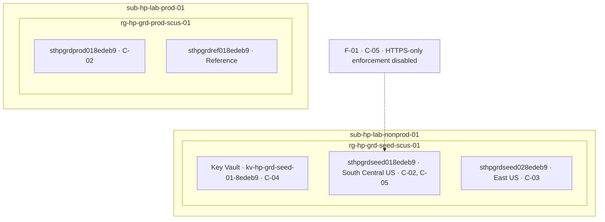

# HarborPine Azure Environment — Before Remediation

```mermaid
flowchart TB
    subgraph sub_prod["sub-hp-lab-prod-01"]
        subgraph rg_prod["rg-hp-grd-prod-scus-01"]
            storage_prod["sthpgrdprod018edeb9 · C-02"]
            storage_ref["sthpgrdref018edeb9 · Reference"]
        end
    end

    subgraph sub_nonprod["sub-hp-lab-nonprod-01"]
        subgraph rg_seed["rg-hp-grd-seed-scus-01"]
            vault_seed["Key Vault · kv-hp-grd-seed-01-8edeb9 · C-04"]
            storage_seed_01["sthpgrdseed018edeb9 · South Central US · C-02, C-05"]
            storage_seed_02["sthpgrdseed028edeb9 · East US · C-03"]
        end
    end

    finding_01["F-01 · C-05 · HTTPS-only enforcement disabled"]
    finding_01 -.-> storage_seed_01
```